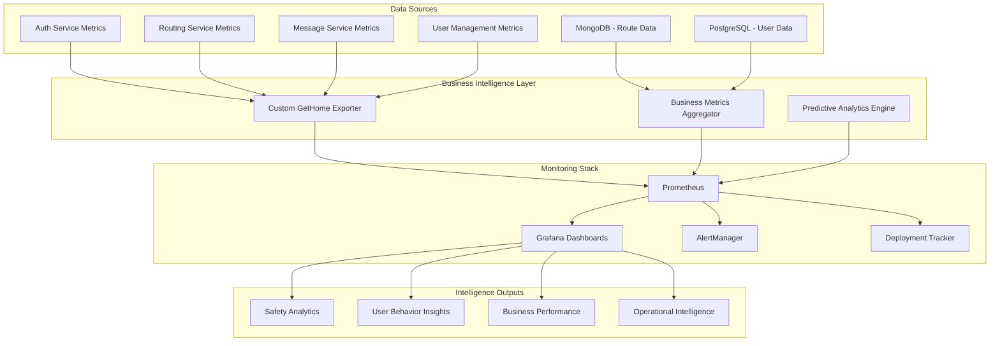

# 🎯 GetHome Advanced Monitoring System

## **Executive Summary**

The GetHome Advanced Monitoring System provides **enterprise-grade business intelligence** and **safety-focused analytics** that go far beyond traditional infrastructure monitoring. This system tracks the real-world impact of our safety platform, monitors user behavior patterns, and provides actionable insights for product and business optimization.

### **🏆 Key Achievements**

- **📊 30+ Custom Business Metrics**: Safety scores, user engagement, emergency response efficiency
- **🤖 Predictive Analytics**: Peak usage forecasting, resource optimization, cost efficiency tracking  
- **🚨 Safety-First Alerting**: Business logic alerts that prioritize user safety over technical metrics
- **📈 Deployment Impact Tracking**: Automated monitoring of how code changes affect business KPIs
- **🎯 Actionable Insights**: Each metric includes contextual explanations and recommended actions

---

## **🎨 Monitoring Architecture Overview**



---

## **📊 Business Intelligence Dashboards**

### **🎯 GetHome Business Intelligence Dashboard**
**URL**: `https://grafana.gethome.local/d/gethome-business-intelligence`

**Purpose**: Comprehensive view of GetHome's business performance, safety impact, and user engagement.

#### **Key Panels & Insights**:

**1. 🎯 Business Impact Overview**
- **What it shows**: Real-world value delivered by GetHome
- **Key metrics**: 
  - Incidents prevented (target: increasing trend)
  - Distance saved through optimization (efficiency indicator)
  - Community safety contribution score (impact measure)
- **Actionable insights**: 
  - Declining incidents prevented → Review danger zone algorithms
  - Low distance optimization → Investigate routing efficiency
  - Poor community score → Focus on safety feature adoption

**2. 🚨 Emergency Response Excellence**
- **What it shows**: Effectiveness of emergency notification system
- **Key metrics**:
  - Response efficiency score (target: >0.8)
  - False alarm rate (target: <15%)
  - Active emergencies count (should trend to zero)
- **Critical thresholds**:
  - Response efficiency <0.7 → Critical alert
  - False alarms >20% → System credibility at risk
  - Active emergencies >5 → Capacity concern

**3. 👥 User Engagement & Safety Adoption**
- **What it shows**: How users interact with safety features
- **Success indicators**:
  - Engagement score >0.7 (strong adoption)
  - Safety conscious users >60% (community impact)
  - High route planning frequency (platform utility)
- **Optimization opportunities**:
  - Low engagement → Improve onboarding
  - Low safety adoption → Enhance feature visibility
  - Low planning frequency → Reduce user friction

**4. 🗺️ Route Safety Intelligence**
- **What it shows**: Performance of core safety algorithms
- **Performance targets**:
  - Safety score >0.75 (excellent), 0.65-0.75 (good), <0.65 (needs work)
  - Optimization effectiveness >85% (excellent)
  - Monitor danger zone density for threat patterns
- **Technical actions**:
  - Low scores → Review algorithms and data quality
  - Poor optimization → Check OpenRoute integration
  - High density → Investigate threat validation

### **📈 Advanced Analytics Panels**

**5. ⚡ System Performance & Reliability**
- **SLA Targets**:
  - Availability: >99.5% (acceptable), >99.9% (premium)
  - API Success: >95% (minimum), >98% (excellent)
  - Latency: <100ms (excellent), <500ms (acceptable)

**6. 🔍 Feature Adoption Analytics**
- **Adoption benchmarks**:
  - >80% adoption: Well-designed, valuable feature
  - 60-80% adoption: Good with improvement potential
  - <60% adoption: Needs UX/education improvements

**7. 🎯 Predictive Analytics**
- **Peak factor >2.0**: Prepare for high load
- **Resource utilization >80%**: Consider scaling
- **Cost efficiency <0.6**: Review optimization opportunities

---

## **🚨 Advanced Alerting System**

### **Alert Categories & Priorities**

#### **🔥 Critical Safety Alerts (Immediate Response)**
1. **Safety Score Critical Drop** 
   - **Trigger**: Safety score <0.6 for 5+ minutes
   - **Impact**: High risk to user safety
   - **Response**: Immediate investigation of routing algorithms

2. **Emergency Response Degraded**
   - **Trigger**: Response efficiency <0.7 for 3+ minutes  
   - **Impact**: Life safety critical
   - **Response**: Emergency team immediate escalation

3. **Location Data Critically Outdated**
   - **Trigger**: Location data >5 minutes old
   - **Impact**: Emergency services can't reach users
   - **Response**: Critical system investigation

#### **⚠️ Business Warning Alerts (Investigation Required)**
1. **User Engagement Drop**
   - **Trigger**: Engagement score drops >20% in 2 hours
   - **Impact**: Potential user churn
   - **Response**: Product team investigation

2. **Low Safety Feature Adoption**
   - **Trigger**: <50% of users using safety features for 30+ minutes
   - **Impact**: Reduced safety value proposition
   - **Response**: UX and onboarding review

3. **Route Optimization Ineffective**
   - **Trigger**: Optimization effectiveness <70% for 15+ minutes
   - **Impact**: Users not getting optimal safe routes
   - **Response**: Technical investigation of algorithms

#### **📊 Operational Info Alerts (Awareness)**
1. **Peak Usage Predicted**
   - **Trigger**: Peak factor >2.0x predicted
   - **Impact**: Potential system strain
   - **Response**: Proactive scaling preparation

2. **Cost Efficiency Declining**
   - **Trigger**: Cost efficiency <0.6 for 1+ hour
   - **Impact**: Higher operational costs
   - **Response**: FinOps optimization review

---

## **🔍 Custom Metrics Deep Dive**

### **Safety & Security Metrics**

```prometheus
# Average safety score across all routes
gethome_safety_score_average
# Target: >0.75 (excellent), >0.65 (acceptable)

# Emergency response efficiency (0-1 scale)
gethome_emergency_response_efficiency_score  
# Target: >0.8 (excellent), >0.7 (acceptable)

# Percentage of emergency alerts that were false alarms
gethome_false_alarm_rate_percentage
# Target: <15% (excellent), <25% (acceptable)

# Current active danger zones in system
gethome_active_danger_zones_count
# Monitor for unusual spikes indicating emerging threats

# Estimated safety incidents prevented through our algorithms
gethome_estimated_incidents_prevented_total
# KPI: Should show increasing trend over time
```

### **User Behavior & Engagement Metrics**

```prometheus
# Overall user engagement score (0-1 scale)
gethome_user_engagement_score
# Target: >0.7 (strong), >0.5 (acceptable)

# Percentage of users regularly using safety features  
gethome_safety_conscious_users_percentage
# Target: >60% for community impact

# Average routes planned per user per day
gethome_route_planning_frequency_per_user_per_day
# KPI: Higher values indicate platform utility

# User retention rate over different periods
gethome_user_retention_rate_percentage{period="30d"}
# Target: >80% (excellent), >70% (good)
```

### **Business Intelligence Metrics**

```prometheus
# Total distance saved through intelligent routing (km)
gethome_total_distance_saved_kilometers
# KPI: Should increase with usage and optimization

# Community safety contribution score (0-1)
gethome_community_safety_contribution_score
# Target: >0.7 (high impact), >0.6 (acceptable)

# Route optimization effectiveness percentage
gethome_route_optimization_effectiveness_percentage
# Target: >85% (excellent), >70% (good)

# Feature adoption rates by feature type
gethome_feature_adoption_rate_percentage{feature="emergency_contacts"}
# Target: >80% for critical safety features
```

### **Predictive & Operational Metrics**

```prometheus
# Predicted peak usage factor for next hour
gethome_peak_usage_prediction_factor
# >2.0 indicates need for proactive scaling

# Forecasted resource utilization percentage
gethome_resource_utilization_forecast_percentage{resource_type="cpu"}
# >80% suggests scaling consideration

# Platform cost efficiency score (0-1)
gethome_cost_efficiency_score
# Target: >0.8 (excellent), >0.6 (acceptable)

# Cross-service communication latency
gethome_cross_service_latency_seconds
# Target: <0.1s (excellent), <0.5s (acceptable)
```

---

## **🚀 Deployment Impact Tracking**

### **How It Works**

The Deployment Tracker automatically monitors the impact of code deployments on business metrics:

1. **Pre-Deployment**: Establishes baseline metrics (15-minute window)
2. **Post-Deployment**: Monitors metrics for 60 minutes after deployment
3. **Impact Analysis**: Compares current vs baseline performance
4. **Automated Reporting**: Sends detailed Slack reports with recommendations

### **Impact Assessment Levels**

| Impact Level | Criteria | Recommendation | Action |
|--------------|----------|----------------|--------|
| **🟢 Healthy** | All metrics within 5% of baseline | Continue monitoring | Standard validation |
| **🟡 Warning** | 1-3 metrics degraded 5-10% | Investigate | Enhanced monitoring |
| **🔴 Critical** | >3 metrics degraded OR >10% degradation | Consider rollback | Immediate investigation |

### **Tracked Metrics During Deployment**

**Business Metrics**:
- Safety score average (degradation threshold: 5%)
- Emergency response efficiency (threshold: 10%)  
- User engagement score (threshold: 5%)
- Route optimization effectiveness (threshold: 5 percentage points)

**Technical Metrics**:
- API success rates (threshold: 2 percentage points)
- System availability (threshold: 1%)
- Response times (threshold: 30 seconds increase)

### **Sample Deployment Report**

```
🚀 **GetHome Deployment Impact Report**

**Service**: routing-service
**Version**: v2.1.3
**Overall Impact Score**: 0.2/1.0
**Recommendation**: MONITOR

📊 **Metric Analysis**:

✅ **Healthy Metrics** (6 metrics):
  • Safety Score: 0.78 → 0.76 (2.6% degradation)
  • API Success Rate: 98.2% → 97.8% (0.4% degradation)
  • System Availability: 99.8% → 99.7% (0.1% degradation)

⚠️ **Performance Warnings** (1 metric):
  • Route Optimization: 87% → 82% (5.7% degradation)

🔍 **INVESTIGATION REQUIRED**
Route optimization effectiveness degraded beyond threshold.

**Next Steps**:
1. Monitor route optimization for 30 minutes
2. Check OpenRoute Service integration logs  
3. Validate safety algorithm changes

📈 **Dashboard**: https://grafana.gethome.local/d/gethome-deployment-impact
```

---

## **📱 Access & Usage Guide**

### **Dashboard Access**

| Dashboard | URL | Purpose |
|-----------|-----|---------|
| **Business Intelligence** | `/d/gethome-business-intelligence` | Main business metrics & insights |
| **Safety Analytics** | `/d/gethome-safety-analytics` | Deep dive into safety performance |
| **User Behavior** | `/d/gethome-user-behavior` | User engagement & adoption metrics |
| **Deployment Impact** | `/d/gethome-deployment-impact` | Code change business impact |
| **Operational Overview** | `/d/gethome-operations` | System health & performance |

### **Alert Channels**

| Channel | Purpose | Response Time |
|---------|---------|---------------|
| `#safety-critical` | Life safety issues | **Immediate** (< 5 min) |
| `#emergency-critical` | Emergency system failures | **Immediate** (< 5 min) |
| `#business-alerts` | Business metric warnings | **1 hour** |
| `#deployment-alerts` | Deployment impact reports | **30 minutes** |
| `#product-alerts` | User experience issues | **4 hours** |

### **Custom Exporter Endpoints**

| Endpoint | Purpose | Update Frequency |
|----------|---------|------------------|
| `:8090/metrics` | GetHome business metrics | 30 seconds |
| `:8091/metrics` | Deployment tracker metrics | Real-time |
| `:9090/api/v1/query` | Prometheus query API | On-demand |

---

## **🎯 Business Intelligence Insights**

### **Safety Performance Analysis**

**🔍 What Good Looks Like**:
- **Safety Score**: Consistently >0.75 with minimal variance
- **Emergency Response**: >90% of emergencies resolved within 10 minutes
- **False Alarms**: <10% of total emergency alerts
- **Danger Zone Coverage**: Comprehensive without over-alerting

**📊 Key Performance Indicators**:
1. **Safety Impact Score**: `(incidents_prevented * 100) + (safety_score * 1000)`
2. **Emergency Effectiveness**: `(resolved_quickly / total_emergencies) * response_time_factor`
3. **Community Trust Index**: `(1 - false_alarm_rate) * user_engagement_score`

**🎯 Optimization Strategies**:
- **Algorithm Tuning**: Use safety score trends to optimize routing algorithms
- **User Education**: Low adoption metrics indicate need for better onboarding
- **Threat Intelligence**: Danger zone patterns reveal community safety trends

### **User Behavior Insights**

**📱 Engagement Patterns**:
- **Peak Usage**: Typically 7-9 AM and 5-7 PM (commuting)
- **Safety Feature Usage**: Higher adoption correlates with urban users
- **Route Planning**: Frequency indicates both necessity and satisfaction

**🎓 User Segmentation**:
1. **Safety Champions** (>0.8 engagement): Power users, provide feature feedback
2. **Casual Users** (0.4-0.8 engagement): Focus on feature discovery
3. **At-Risk Users** (<0.4 engagement): Churn prevention targets

**📈 Growth Metrics**:
- **Activation**: Users who plan >3 routes in first week
- **Retention**: Users still active after 30 days
- **Expansion**: Users who enable >2 safety features

### **Operational Excellence**

**⚡ Performance Optimization**:
- **Response Time Targets**: P95 <500ms for all critical paths
- **Availability Goals**: 99.9% uptime during peak hours
- **Scalability Planning**: Auto-scale at 70% resource utilization

**💰 Cost Optimization**:
- **API Efficiency**: Monitor expensive OpenRoute Service calls
- **Resource Right-sizing**: Use forecasting to optimize compute allocation
- **Data Storage**: Optimize time-series data retention policies

---

## **🔧 Troubleshooting Guide**

### **Common Alert Scenarios**

#### **"Safety Score Critically Low"**
**Possible Causes**:
1. OpenRoute Service API issues
2. Danger zone data quality problems
3. Algorithm regression from recent deployment
4. Database connectivity issues

**Investigation Steps**:
1. Check OpenRoute Service response times and error rates
2. Validate recent danger zone reports for accuracy
3. Review recent routing service deployments
4. Test route calculation with known coordinates
5. Verify MongoDB danger zone collection health

**Resolution Actions**:
- Rollback recent routing service changes if needed
- Switch to backup routing provider if OpenRoute fails
- Clean up invalid danger zone data
- Scale routing service if performance issues

#### **"Emergency Response Degraded"**
**Possible Causes**:
1. Email/SMS service outages
2. Emergency contact data issues
3. Notification service performance problems
4. Network connectivity issues

**Investigation Steps**:
1. Test email and SMS delivery manually
2. Check emergency contact database integrity
3. Monitor message service performance metrics
4. Verify external service provider status
5. Test WebSocket notification delivery

**Resolution Actions**:
- Switch to backup notification providers
- Escalate to emergency service partners if needed
- Scale message service infrastructure
- Repair emergency contact data inconsistencies

#### **"User Engagement Dropping"**
**Possible Causes**:
1. App performance issues
2. New feature confusion
3. Onboarding flow problems
4. Competitor actions

**Investigation Steps**:
1. Analyze user journey completion rates
2. Review app store ratings and feedback
3. Check feature adoption metrics
4. Conduct user interviews
5. A/B test onboarding improvements

**Resolution Actions**:
- Optimize app performance bottlenecks
- Improve feature discoverability
- Simplify onboarding flow
- Create user education content

### **Metric Correlation Analysis**

**Safety Performance Correlations**:
- ↑ Danger zones → ↓ Safety scores (expected)
- ↑ False alarms → ↓ User engagement (user trust)
- ↓ Response time → ↑ Emergency efficiency (system performance)

**Business Impact Correlations**:
- ↑ Safety adoption → ↑ User retention (feature value)
- ↑ Route frequency → ↑ Engagement score (platform utility)  
- ↓ System availability → ↓ All business metrics (infrastructure impact)

---

## **📚 Best Practices & Recommendations**

### **Monitoring Best Practices**

1. **Focus on Business Outcomes**: Prioritize metrics that reflect real user value
2. **Actionable Alerts**: Every alert should have clear investigation steps
3. **Context-Rich Dashboards**: Include annotations explaining what metrics mean
4. **Trend Analysis**: Look for patterns over time, not just point-in-time values
5. **User-Centric Metrics**: Measure what matters to user safety and experience

### **Alert Management**

1. **Alert Fatigue Prevention**: Tune thresholds to reduce false positives
2. **Escalation Policies**: Critical safety alerts bypass normal escalation
3. **Documentation**: Every alert links to runbook with resolution steps
4. **Post-Incident Reviews**: Learn from each alert and improve detection

### **Dashboard Design**

1. **Progressive Disclosure**: Start with overview, drill down for details
2. **Visual Hierarchy**: Most important metrics prominently displayed
3. **Color Coding**: Red for critical, yellow for warning, green for healthy
4. **Time Context**: Show recent trends and historical comparisons

### **Metric Evolution**

1. **Regular Review**: Quarterly assessment of metric relevance
2. **Business Alignment**: Ensure metrics reflect current business priorities  
3. **User Feedback**: Incorporate user satisfaction into success metrics
4. **Competitive Analysis**: Benchmark against industry standards

---

## **🎓 Training & Onboarding**

### **Team Responsibilities**

| Team | Primary Metrics | Alert Response |
|------|----------------|----------------|
| **Safety Engineering** | Safety scores, danger zones, emergency response | Critical safety alerts |
| **Product Team** | User engagement, feature adoption, retention | Business performance alerts |
| **Platform Team** | System performance, availability, costs | Technical infrastructure alerts |
| **Growth Team** | User acquisition, retention, engagement trends | User behavior alerts |

### **Onboarding Checklist**

**For New Team Members**:
- [ ] Dashboard access configured
- [ ] Slack alert channels joined
- [ ] Runbook access verified
- [ ] Training on business metrics completed
- [ ] Shadow incident response
- [ ] Practice using investigation tools

**For Product Managers**:
- [ ] Business intelligence dashboard training
- [ ] User behavior analytics deep dive
- [ ] Feature adoption tracking setup
- [ ] A/B testing metric integration

**For Engineers**:
- [ ] Technical metrics understanding
- [ ] Alert investigation procedures
- [ ] Deployment impact tracking
- [ ] Custom metrics implementation

---

## **🔮 Future Enhancements**

### **Planned Improvements**

1. **AI-Powered Insights** (Q2 2024)
   - Machine learning anomaly detection
   - Predictive user churn modeling
   - Automated root cause analysis

2. **Enhanced Business Intelligence** (Q3 2024)
   - Real-time user journey tracking
   - Cohort analysis dashboards
   - Revenue impact attribution

3. **Advanced Safety Analytics** (Q4 2024)
   - Predictive danger zone modeling
   - Community safety scoring
   - Emergency response optimization

### **Integration Roadmap**

1. **External Data Sources**
   - Weather impact on routing
   - Traffic pattern correlation
   - Crime statistics integration

2. **Enhanced Alerting**
   - Mobile push notifications
   - Integration with incident management
   - Automated remediation for common issues

3. **Business Intelligence**
   - Executive dashboard suite
   - Automated weekly reports
   - Competitive benchmarking

---

## **📞 Support & Escalation**

### **Getting Help**

| Issue Type | Contact | Response Time |
|------------|---------|---------------|
| **Critical Safety Alert** | #safety-critical + on-call | **Immediate** |
| **Dashboard Access** | #platform-support | 4 hours |
| **Metric Questions** | #monitoring-help | 1 business day |
| **Custom Metrics** | Platform team | 2-3 business days |

### **Escalation Matrix**

```
Level 1: Team Lead (30 min response)
Level 2: Engineering Manager (1 hour response)  
Level 3: VP Engineering (2 hour response)
Level 4: CTO (4 hour response)
```

### **Emergency Contacts**

- **Safety Team Lead**: safety-lead@gethome.com
- **Platform On-Call**: +1-555-PLATFORM
- **Executive Escalation**: exec-escalation@gethome.com

---

**📝 Document Version**: 1.0.0  
**Last Updated**: December 2024  
**Next Review**: March 2025  
**Owner**: Platform Engineering Team

---

*This monitoring system represents a significant investment in understanding and optimizing GetHome's impact on user safety and business success. Use these insights to make data-driven decisions that prioritize user safety while driving business growth.* 